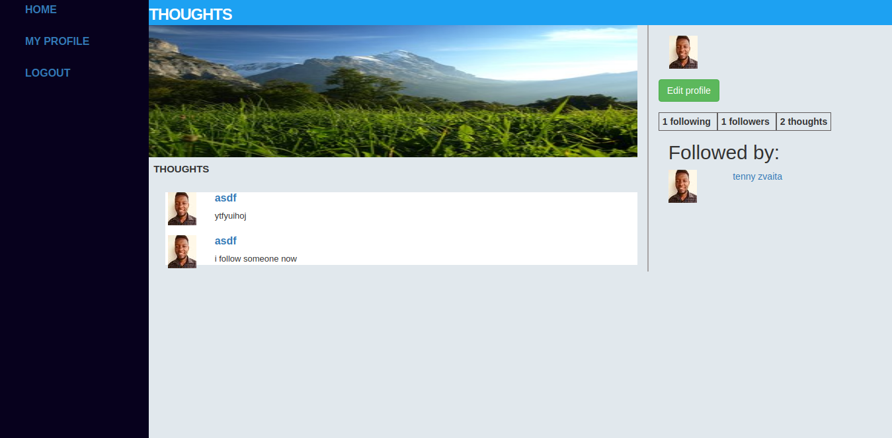

# Thoughts app with Ruby on Rails

This is the repository for the ruby on rails capstone project for microverse curriculum. The application was published on [Heroku.](https://damp-lake-87370.herokuapp.com/)

## Built With

- Ruby v2.7.1
- Ruby on Rails v5.2.4

## Live Demo

https://damp-lake-87370.herokuapp.com/

## Project showcase video

https://www.loom.com/share/725e82a2848f4016ba04875577b89d76

## Getting Started

To get a local copy up and running follow these simple example steps.

### Prerequisites

Ruby: 2.6.3
Rails: 5.2.3
Postgres: >=9.5

### Setup

Install gems with:

```
bundle install
```

Setup database with:

```
   rails db:create
   rails db:migrate
```


### Usage

Start server with:

```
    rails server
```

Open `http://localhost:3000/` in your browser.

### Run tests

```
    rpsec --format documentation
```

> Tests are included which are done with Rspec for both unit and integration tests.
### Deployment

The application was made live on the Heroku platoform and it can be accessed [here.](https://damp-lake-87370.herokuapp.com/)


## Authors
+ Tennyson Zvaita - [@tennyzvaita](https://twitter.com/tennyzvaita) - tzvaita@gmail.com

## 🤝 Contributing

Contributions, issues and feature requests are welcome!

Feel free to check the [issues page](issues/).

## Show your support

Give a ⭐️ if you like this project!

## Acknowledgments

- Microverse.org
- Stackoverflow
- Heroku
- Rails docs
- Mike Hartl ruby on rails learn enough
- Gregoire Vella on Behance
- Bootstrap
- Careerwave gem
